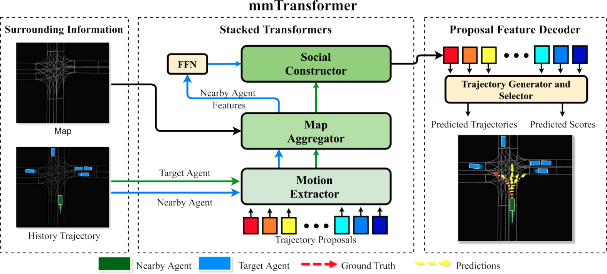
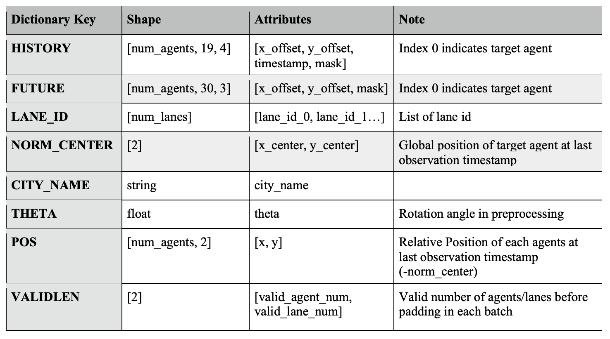
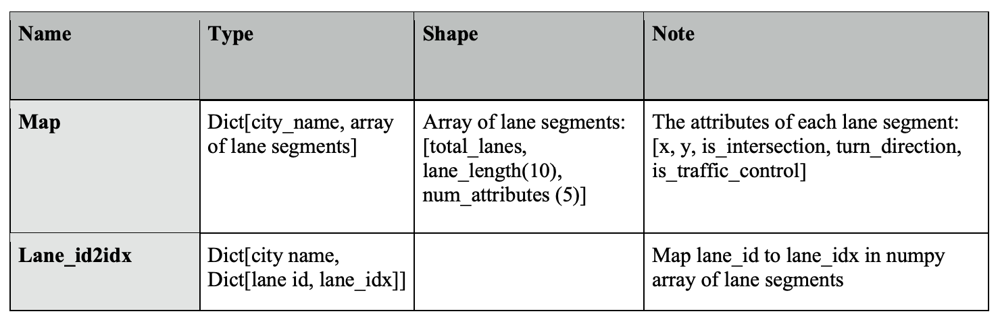

# mmTransformer

## Introduction

- This repo is official implementation for [mmTransformer](https://github.com/decisionforce/mmTransformer) in pytorch. Currently, the core code of mmTransformer is implemented in the commercial project, we provide **inference code** of model with six trajectory propopals for your reference. 

- For other information, please refer to our paper **Multimodal Motion Prediction with Stacked Transformers**. (CVPR 2021) [[Paper](https://arxiv.org/pdf/2103.11624.pdf)] [[Webpage](https://decisionforce.github.io/mmTransformer/)]



## Set up your virtual environment

- Initialize virtual environment:

      conda create -n mmTrans python=3.7

- Install agoverse api. Please refer to [this page](https://github.com/argoai/argoverse-api).

- Install the [pytorch](https://pytorch.org/). The latest codes are tested on Ubuntu 16.04, CUDA11.1, PyTorch 1.8 and Python 3.7:
  (Note that we require the version of torch >= 1.5.0 for testing with pretrained model)

      pip install torch==1.8.0+cu111\
            torchvision==0.9.0+cu111\
            torchaudio==0.8.0 -f https://download.pytorch.org/whl/torch_stable.html

- For other requirement, please install with following command:

      pip install -r requirement.txt
    

## Preparation

### Download the code, model and data

1. Clone this repo from the GitHub.

        git clone https://github.com/decisionforce/mmTransformer.git

2. Download the pretrained model and data [[here](https://drive.google.com/file/d/10koDID95zoOnU3pb6AkHAqJInupMScJd/view?usp=sharing)] (map.pkl for Python 3.7 is available [[here](https://drive.google.com/file/d/1HbsgutM1PKjPj-3IIA5kG3mJEMhHGhS0/view?usp=sharing)]) and save it to `./models` and `./interm_data`.
   
        cd mmTransformer
        mkdir models
        mkdir interm_data

3. Finally, your directory structure should look something like this:

        mmTransformer
        └── models
            └── demo.pt
        └── interm_data
            └── argoverse_info_val.pkl
            └── map.pkl

### Preprocess the dataset

Alternatively, you can process the data from scratch using following commands.

1. Download Argoverse dataset and create a symbolic link to `./data` folder or use following commands.

        cd path/to/mmtransformer/root
        mkdir data
        cd data
        wget https://s3.amazonaws.com/argoai-argoverse/forecasting_val_v1.1.tar.gz 
        tar -zxvf  forecasting_val_v1.1.tar.gz

2. Then extract the agent and map information from raw data via Argoverse API:

        python -m lib.dataset.argoverse_convertor ./config/demo.py

3. Finally, your directory structure should look something like above illustrated.


Format of processed data in ‘argoverse_info_val.pkl’:



Format of map information in ‘map.pkl’:




## Run the mmTransformer

For testing:

    python Evaluation.py ./config/demo.py --model-name demo

## Results

Here we showcase the expected results on validation set:

| Model | Expected results | Results in paper
|--|--|--|
| minADE | 0.709 | 0.713 |
| minFDE | 1.081 | 1.153 |
| MR (K=6) | 10.2 | 10.6 |

## TODO

- We are going to open source our visualization tools and a demo result. (TBD)

## Contact us
If you have any issues with the code, please contact to this email: <moooooore66@gmail.com>

## Citation
If you find our work useful for your research, please consider citing the paper
```
@article{liu2021multimodal,
  title={Multimodal Motion Prediction with Stacked Transformers},
  author={Liu, Yicheng and Zhang, Jinghuai and Fang, Liangji and Jiang, Qinhong and Zhou, Bolei},
  journal={Computer Vision and Pattern Recognition},
  year={2021}
}
```
